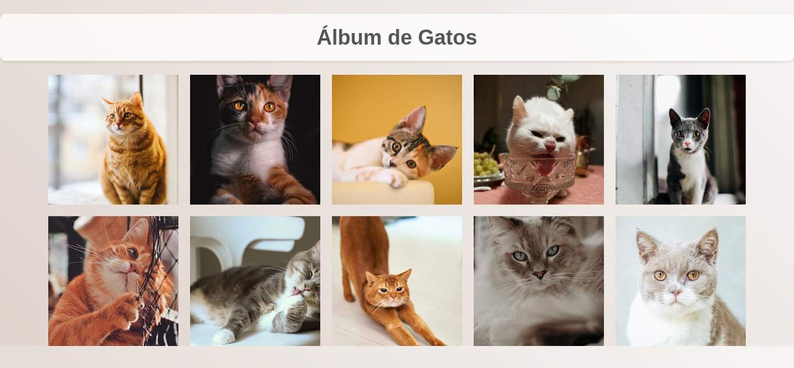

# Álbum de Gatos
   #### Tarefa 10 da Descodificadas

Este projeto consiste em um álbum de fotos de gatos exibido em uma página web. As imagens são organizadas em uma grade utilizando CSS Grid, permitindo que sejam exibidas em três colunas com tamanho responsivo.

## Funcionalidades

- Exibe uma grade de imagens de gatos.
- As imagens se ajustam automaticamente em três colunas.
- Ao passar o mouse sobre uma imagem, ela é ampliada em 20% do seu tamanho original.

## Imagem Principal

Este projeto foi criado por Mayara Rocha.
